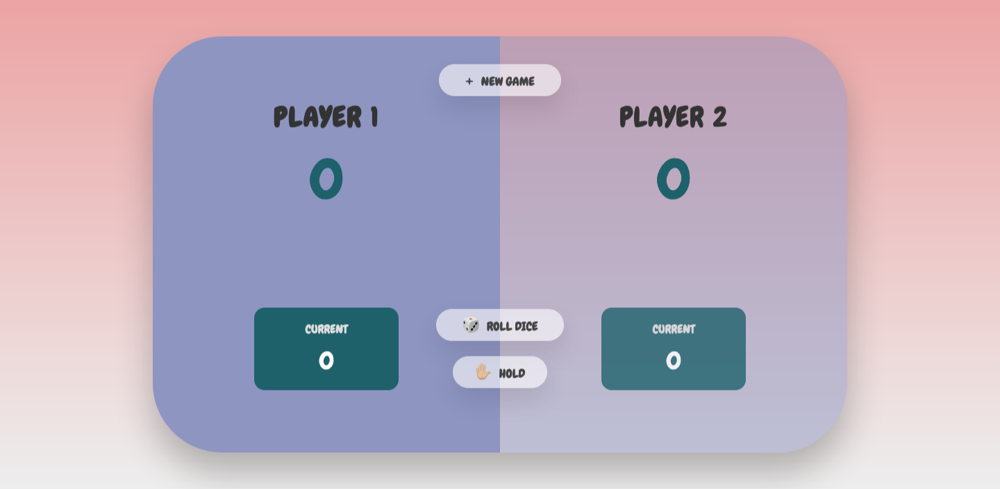

# Table of contents

- [Overview](#overview)
  - [The challenge](#the-challenge)
  - [Screenshot](#screenshot)
  - [Links](#links)
- [My process](#my-process)
  - [Built with](#built-with)

## Overview

### The challenge

Users should be able to:

- Play the game
- Restart the game
- Hold their score
- Game ends when one player reaches the score of 100
- Switches to the other player's turn if the current player rolls a "1"

### Screenshot

### Links

- Live Site URL: [https://mw3981.github.io/dice-game/]

## My process

### Built with

- Semantic HTML5
- CSS
- Javascript

## Author

- Website - [Michelle Wong](https://michellewong.me/)
